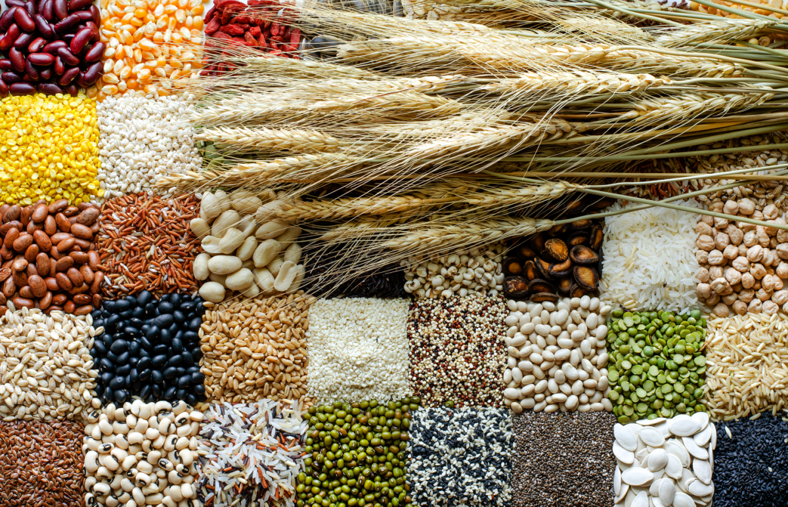

# ANÁLISE DETALHADA DA EVOLUÇÃO DO PREÇO DA MATÉRIA-PRIMA AGRÍCOLA

> O projeto em questão, Análise Detalhada Da Evolução Do Preço Da Matéria-Prima Agrícola, visa atender cooperativas agrícolas e negócios do ramo, que usam de base as matérias-primas analisadas neste projeto para um melhor planejamento de compra e posicionamento quanto a aquisição sazonal desses produtos.

## ☕ Usando no Projeto as Seguintes Ferramentas

Programa desenvolvido no:

- [x] Jupyter Notebook
- [x] Google Colab

Ferramentas utilizadas no projeto:

- [x] Python
- [x] Kaggle

Bibliotecas utilizadas:

- [x] Pandas
- [x] Numpy
- [x] Matplotlib
- [x] Seaborn

## 💻 Arquivos

Descrição dos arquivos do repositório:

- Projeto no Jupyter Notebok `materias_primas_de_agricultura.ipynb`.
- Código em Python `materias_primas_de_agricultura.py`. 
- Base de Dados Analisados `agricultural_raw_material.csv`.

## 🤝 Equipe

<table>
  <tr>
    <td align="center">
      <a href="#" title="foto de Leonardo Alves">
         
        
          <b>Leonardo Alves</b>
        
      </a>
    </td>
  </tr>
</table>

## 📝 Finalidade

Esse projeto foi desenvolvido para conclusão da cadeira de Tópicos em Big Data em Python
